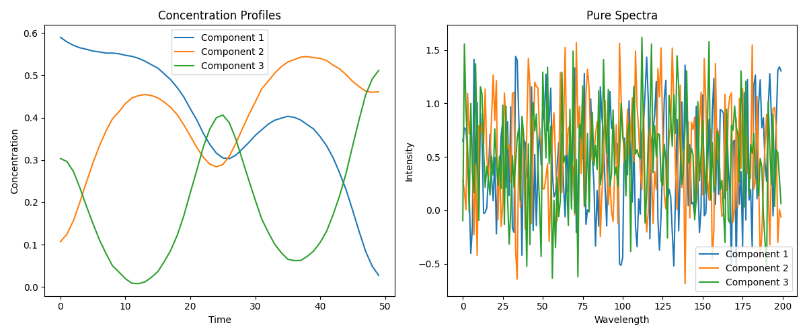
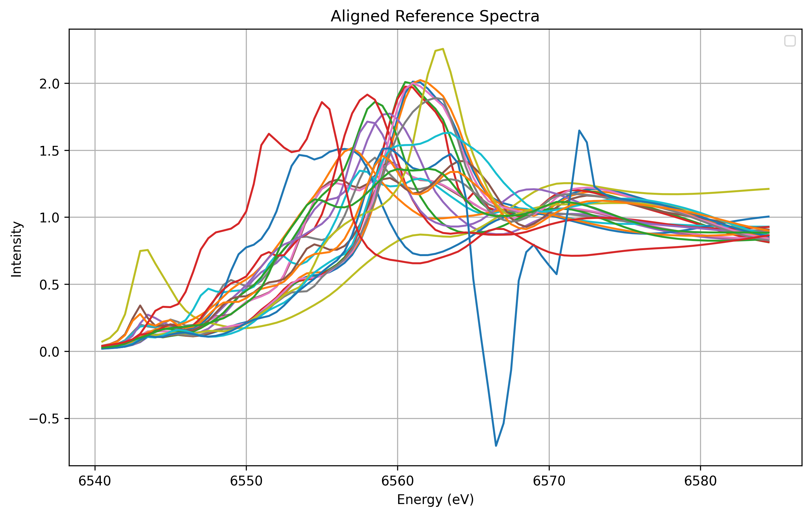
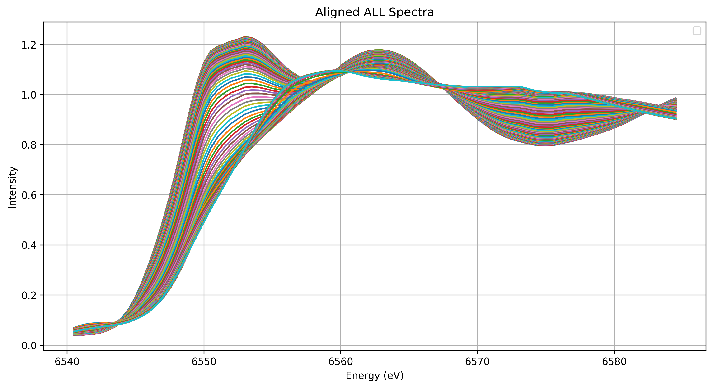

# MCRALS 做法一
## 给定 num_component，未给定参考光谱，给定浓度的约束条件（和为一、非负、单调）
## 结果
- **Failure**: 得到的纯谱线形不是 XAS

### 观察
看上去非常类似深度学习训练的结果。

# MCRALS 做法二
## 无需给定 num_component，给定（任意数量）参考光谱，给定约束条件
## 困难
- 算法复杂度太大，基本是通过减小 tolerance 以及 max_iters 来加快计算。
.png)

### 注意
以上评估不一定准确，需要再评估。

## 数据处理
- 各参考光谱的入射能量维度需要对齐，采用插值法，截取数据范围 [6540.5, 6585, 0.5]。
- 原始时间分辨谱也需要与其对齐。

## 初步结果
-  初步结果表明：ref#4（Mn2O3_mp-1043363）以及 ref#9（Mn5O7_mp-1046066）占比例大。

-   目前结果也不甚合理，其他各种噪声（谱图）占比0.5左右。

##  Adjust tolerance
-   不影响结果

##  todo：目标函数
##  todo：改变初猜
